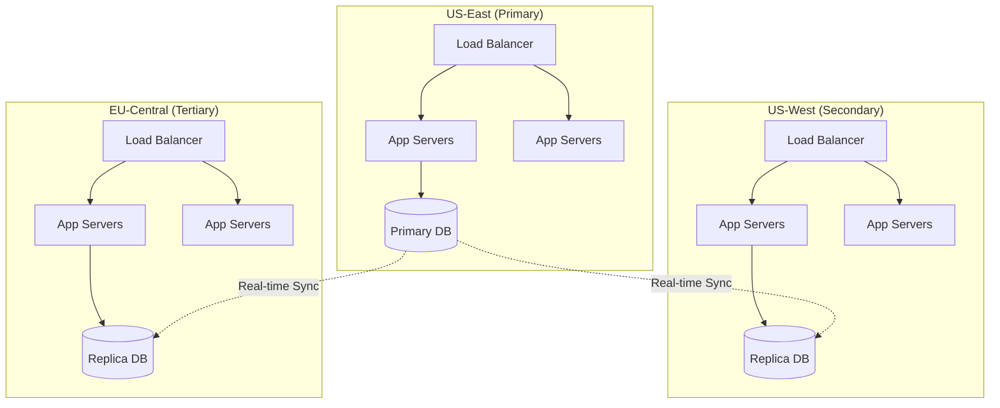

# HedgePayments: Security & AI Agent Architecture
## Next-Generation Payment Infrastructure with Autonomous Intelligence

---

## 🔐 PART 1: MULTI-LAYERED SECURITY ARCHITECTURE

### 1.1 Zero-Trust Security Model

#### Core Principles
```yaml
Never Trust, Always Verify:
  - Every request authenticated
  - Every action authorized
  - Every data access logged
  - Every connection encrypted

Security Layers:
  Network Layer:
    - AWS WAF / Cloudflare protection
    - DDoS mitigation (100Gbps capacity)
    - Geographic IP filtering
    - Rate limiting per endpoint

  Application Layer:
    - JWT token validation (15-min expiry)
    - API key rotation (90 days)
    - OAuth 2.0 / OIDC integration
    - Session management with Redis

  Data Layer:
    - AES-256-GCM encryption at rest
    - TLS 1.3 encryption in transit
    - Field-level encryption for PII
    - Tokenization for payment data
```

### 1.2 Payment Data Security

#### Tokenization Architecture
```typescript
interface TokenizationSystem {
  vault: {
    provider: 'AWS KMS' | 'HashiCorp Vault'
    encryption: 'AES-256-GCM'
    keyRotation: '30 days'
    backups: 'multi-region'
  }

  tokenization: {
    cardNumbers: 'Format-preserving encryption'
    bankAccounts: 'Irreversible tokens'
    personalData: 'Reversible with audit'
    apiKeys: 'Hashed with salt'
  }

  access: {
    readPermissions: 'Role-based + MFA'
    writePermissions: 'Quorum approval'
    deletePermissions: 'Disabled'
    auditLog: 'Immutable ledger'
  }
}
```

#### Hardware Security Module (HSM) Integration
- **AWS CloudHSM** for cryptographic operations
- **FIPS 140-2 Level 3** certified
- Master keys never leave HSM boundary
- 99.999% availability with clustering
- Sub-millisecond cryptographic operations

### 1.3 Compliance & Regulatory Framework

#### PCI DSS Level 1 Implementation
```yaml
Requirement Coverage:
  1. Firewall Configuration:
     - Stateful inspection firewalls
     - Micro-segmentation with VPCs
     - Zero inbound rules on databases

  2. Default Security Parameters:
     - No default passwords
     - Automated security hardening
     - CIS benchmark compliance

  3. Cardholder Data Protection:
     - No storage of CVV/CVV2
     - Tokenization within 100ms
     - Encrypted transmission only

  4. Encryption Standards:
     - TLS 1.3 minimum
     - Strong cryptography (AES-256)
     - Key management procedures

  5. Antivirus/Anti-malware:
     - Real-time scanning
     - Daily signature updates
     - Behavioral analysis

  6. Secure Development:
     - SAST/DAST scanning
     - Dependency vulnerability checks
     - Security training program
```

#### Global Compliance Matrix
| Region | Requirement | Implementation | Timeline |
|--------|------------|----------------|----------|
| **US** | FinCEN Registration | Complete KYC/AML system | Month 1 |
| **US** | State MTL | 50-state licensing | Month 1-12 |
| **EU** | GDPR | Privacy by design | Month 1 |
| **EU** | PSD2 | Strong Customer Auth | Month 3 |
| **UK** | FCA Registration | E-money license | Month 6 |
| **CA** | FINTRAC | AML compliance | Month 4 |
| **AU** | AUSTRAC | Digital currency exchange | Month 8 |
| **SG** | MAS | Payment services license | Month 10 |

---

## 🤖 PART 2: AI AGENT ECOSYSTEM

### 2.1 Security AI Agents

#### 🛡️ Sentinel Agent (24/7 Security Monitor)
```python
class SentinelAgent:
    """Real-time security monitoring and threat response"""

    capabilities = {
        'transaction_monitoring': {
            'volume': '10M+ transactions/day',
            'latency': '<50ms per check',
            'accuracy': '99.7% threat detection'
        },
        'pattern_recognition': {
            'models': ['LSTM', 'Transformer', 'GNN'],
            'features': 200+,
            'update_frequency': 'hourly'
        },
        'automated_response': {
            'block_suspicious': '<100ms',
            'alert_severity': ['low', 'medium', 'high', 'critical'],
            'escalation': 'automatic'
        }
    }

    def monitor_transaction(self, tx):
        risk_score = self.calculate_risk(tx)
        if risk_score > 0.8:
            self.block_and_investigate(tx)
        elif risk_score > 0.6:
            self.flag_for_review(tx)
        return self.process_normally(tx)
```

#### 🔍 Compliance Agent (Regulatory Automation)
```python
class ComplianceAgent:
    """Automated compliance monitoring and reporting"""

    responsibilities = {
        'kyc_verification': {
            'identity_check': 'Jumio/Persona API',
            'document_verification': 'OCR + liveness',
            'completion_time': '<2 minutes'
        },
        'aml_screening': {
            'sanctions_lists': ['OFAC', 'UN', 'EU', 'UK'],
            'pep_checking': 'WorldCheck API',
            'continuous_monitoring': '24/7'
        },
        'transaction_monitoring': {
            'suspicious_patterns': 'ML detection',
            'reporting': 'Automated SAR/CTR',
            'audit_trail': 'Immutable logs'
        }
    }
```

#### 🔬 Vulnerability Hunter Agent
```yaml
VulnerabilityHunter:
  continuous_scanning:
    - OWASP Top 10 checks
    - Dependency vulnerability (Snyk/Dependabot)
    - Infrastructure misconfigurations
    - API endpoint fuzzing
    - SQL injection testing

  automated_pentesting:
    - Weekly security scans
    - Simulated attacks
    - Social engineering tests
    - Red team exercises

  reporting:
    - Real-time alerts
    - CVSS scoring
    - Remediation guidance
    - Patch prioritization
```

### 2.2 Payment Optimization Agents

#### 💰 SmartRouter Agent (Intelligent Payment Routing)
```typescript
interface SmartRouter {
  routingLogic: {
    factors: {
      successRate: Weight<0.3>
      processingFee: Weight<0.25>
      settlementTime: Weight<0.2>
      providerHealth: Weight<0.15>
      userPreference: Weight<0.1>
    }

    algorithm: 'Multi-Armed Bandit with Thompson Sampling'
    updateFrequency: 'Real-time'

    decisions: {
      primaryRoute: Provider
      fallbackRoutes: Provider[]
      maxRetries: 3
      timeoutMs: 5000
    }
  }

  optimization: {
    costSavings: '15-20% average'
    successImprovement: '+3.5% average'
    latencyReduction: '200ms average'
  }
}
```

#### 📊 Analytics Genius Agent
```python
class AnalyticsGenius:
    """Predictive analytics and business intelligence"""

    predictions = {
        'revenue_forecasting': {
            'model': 'Prophet + SARIMA',
            'accuracy': 'MAPE < 5%',
            'horizon': '90 days'
        },
        'churn_prediction': {
            'model': 'XGBoost',
            'accuracy': 'AUC > 0.92',
            'early_warning': '30 days'
        },
        'fraud_trends': {
            'model': 'Isolation Forest + DBSCAN',
            'detection_rate': '99.5%',
            'false_positive': '<0.1%'
        }
    }

    insights = {
        'payment_optimization': 'Route recommendations',
        'pricing_strategy': 'Dynamic fee optimization',
        'market_opportunities': 'Growth area identification'
    }
```

### 2.3 Infrastructure Management Agents

#### 🔧 AutoScaler Agent
```yaml
AutoScaler:
  monitoring:
    - CPU utilization
    - Memory usage
    - Request latency
    - Queue depth
    - Error rates

  scaling_policies:
    horizontal:
      min_instances: 3
      max_instances: 1000
      target_cpu: 70%
      scale_out_cooldown: 60s
      scale_in_cooldown: 300s

    vertical:
      instance_types: [t3.medium, c5.xlarge, c5.4xlarge]
      upgrade_threshold: 85%
      downgrade_threshold: 30%

  predictive_scaling:
    - Historical pattern analysis
    - Event-based pre-scaling
    - Cost optimization
    - Spot instance utilization
```

#### 🏗️ Architect Agent (Code Quality & Maintenance)
```typescript
interface ArchitectAgent {
  codeQuality: {
    analysis: {
      complexity: 'Cyclomatic & Cognitive'
      duplication: 'CPD detection'
      coverage: 'Line, Branch, Function'
      security: 'SAST + DAST'
    }

    automation: {
      reviews: 'PR analysis with suggestions'
      refactoring: 'Automated improvements'
      documentation: 'Auto-generated docs'
      testing: 'Test case generation'
    }
  }

  maintenance: {
    dependencies: 'Automated updates with testing'
    performance: 'Profiling and optimization'
    debt: 'Technical debt tracking'
    migrations: 'Automated schema updates'
  }
}
```

---

## 🔄 PART 3: REDUNDANCY & RESILIENCE

### 3.1 Multi-Provider Redundancy Strategy

```yaml
Provider Hierarchy:
  Cards:
    Primary: Stripe (60% traffic)
    Secondary: Checkout.com (30% traffic)
    Tertiary: Direct Visa/MC (10% traffic)
    Failover: <500ms switching

  ACH:
    Primary: Dwolla (70% traffic)
    Secondary: Modern Treasury (20% traffic)
    Tertiary: Plaid (10% traffic)
    Failover: Automatic retry logic

  Crypto:
    Primary: Coinbase Commerce (80% traffic)
    Secondary: Circle (20% traffic)
    Failover: Multi-signature wallets

  BNPL:
    Load Balanced: [Klarna, Afterpay, Affirm]
    Selection: Based on merchant category
```

### 3.2 Geographic Redundancy



### 3.3 Failure Recovery Mechanisms

#### Circuit Breaker Pattern
```typescript
class CircuitBreaker {
  states = ['CLOSED', 'OPEN', 'HALF_OPEN']

  config = {
    failureThreshold: 5,        // failures before opening
    successThreshold: 3,        // successes to close
    timeout: 30000,             // ms before half-open
    monitoringWindow: 60000     // sliding window
  }

  async execute(request: PaymentRequest) {
    if (this.state === 'OPEN') {
      if (this.shouldAttemptReset()) {
        this.state = 'HALF_OPEN'
      } else {
        throw new Error('Circuit breaker is OPEN')
      }
    }

    try {
      const result = await this.makeRequest(request)
      this.onSuccess()
      return result
    } catch (error) {
      this.onFailure()
      throw error
    }
  }
}
```

---

## 📈 PART 4: SCALABILITY & PERFORMANCE

### 4.1 Database Architecture

```yaml
Database Strategy:
  Primary Database:
    Type: PostgreSQL with Citus
    Sharding: By merchant_id
    Replicas: 3 per region
    Backup: Continuous with PITR

  Cache Layer:
    Redis Cluster:
      Nodes: 6 (3 master, 3 replica)
      Memory: 256GB total
      Persistence: AOF with fsync

    Use Cases:
      - Session storage
      - Rate limiting
      - Hot data caching
      - Distributed locks

  Time-Series Data:
    TimescaleDB:
      Retention: 2 years
      Compression: After 30 days
      Continuous Aggregates: Hourly, Daily

  Search & Analytics:
    Elasticsearch:
      Nodes: 5
      Indices: Transaction, Audit, Metrics
      Retention: 90 days hot, 2 years warm
```

### 4.2 Message Queue Architecture

```yaml
Event-Driven Architecture:
  Message Broker:
    Primary: Apache Kafka
    Topics:
      - payment.initiated
      - payment.processed
      - payment.failed
      - webhook.outbound
      - audit.events

    Configuration:
      Partitions: 100 per topic
      Replication: 3
      Retention: 7 days
      Throughput: 1M messages/sec

  Task Queue:
    Technology: Celery with Redis
    Workers: Auto-scaling 10-500
    Queues:
      - high_priority (payments)
      - medium_priority (webhooks)
      - low_priority (reports)
```

---

## 🚀 PART 5: AI-POWERED FEATURES FOR USERS

### 5.1 Natural Language Payment Processing

```python
class NaturalPaymentAgent:
    """Process payments through natural language"""

    examples = [
        "Send $500 to vendor ABC for invoice #12345",
        "Refund yesterday's transaction from John Doe",
        "Set up recurring payment of $99/month to SaaS Inc",
        "Split $1000 equally among team members"
    ]

    def process_command(self, text: str):
        intent = self.extract_intent(text)  # NLP model
        entities = self.extract_entities(text)  # NER

        if self.requires_confirmation(intent, entities):
            return self.generate_confirmation(intent, entities)

        return self.execute_payment(intent, entities)
```

### 5.2 Intelligent Integration Assistant

```typescript
interface IntegrationAssistant {
  capabilities: {
    codeGeneration: {
      languages: ['JavaScript', 'Python', 'Ruby', 'Go', 'PHP']
      frameworks: ['React', 'Vue', 'Angular', 'Django', 'Rails']
      examples: 'Context-aware snippets'
    }

    debugging: {
      errorAnalysis: 'Stack trace interpretation'
      suggestions: 'Fix recommendations'
      testing: 'Automated test generation'
    }

    optimization: {
      performance: 'Bottleneck identification'
      security: 'Vulnerability scanning'
      cost: 'Fee optimization suggestions'
    }
  }
}
```

### 5.3 Predictive Business Intelligence

```python
class BusinessIntelligenceAgent:
    """Provide actionable business insights"""

    reports = {
        'daily_summary': {
            'revenue': 'Real-time tracking',
            'transactions': 'Volume and success rates',
            'issues': 'Failed payments analysis',
            'opportunities': 'Growth recommendations'
        },

        'predictive_analytics': {
            'revenue_forecast': '90-day projection',
            'churn_risk': 'At-risk merchant identification',
            'fraud_trends': 'Emerging threat patterns',
            'market_opportunities': 'Expansion recommendations'
        },

        'optimization_suggestions': {
            'routing': 'Cost-saving opportunities',
            'pricing': 'Fee structure optimization',
            'features': 'Usage-based recommendations',
            'integrations': 'New provider suggestions'
        }
    }
```

---

## 📊 PART 6: IMPLEMENTATION ROADMAP

### Phase 1: Security Foundation (Months 1-6)
```yaml
Month 1-2: Core Security
  - Zero-trust network setup
  - HSM integration
  - Basic encryption infrastructure
  - PCI DSS gap analysis
  Budget: $800K

Month 3-4: Compliance Framework
  - KYC/AML system implementation
  - Regulatory filing preparation
  - Audit trail system
  - Policy documentation
  Budget: $600K

Month 5-6: Threat Detection
  - Basic fraud detection models
  - Real-time monitoring dashboard
  - Incident response procedures
  - Security team training
  Budget: $500K
```

### Phase 2: AI Intelligence Layer (Months 7-12)
```yaml
Month 7-8: Core AI Agents
  - Sentinel security agent
  - SmartRouter implementation
  - Basic analytics agent
  - Agent orchestration platform
  Budget: $1.2M

Month 9-10: Optimization Agents
  - Advanced routing algorithms
  - Predictive analytics models
  - AutoScaler implementation
  - Performance optimization
  Budget: $800K

Month 11-12: User-Facing AI
  - Natural language processing
  - Integration assistant
  - Intelligent support system
  - MCP tools deployment
  Budget: $700K
```

### Phase 3: Global Scale (Months 13-18)
```yaml
Month 13-14: Geographic Expansion
  - Multi-region deployment
  - Local compliance implementation
  - Regional payment methods
  - Localization
  Budget: $1.5M

Month 15-16: Enterprise Features
  - Advanced analytics platform
  - Custom reporting tools
  - White-label solutions
  - API marketplace
  Budget: $1M

Month 17-18: Innovation Platform
  - AI model marketplace
  - Developer ecosystem
  - Advanced automation
  - Next-gen features
  Budget: $900K
```

---

## 💰 PART 7: FINANCIAL ANALYSIS

### 7.1 Investment Requirements

| Category | Phase 1 | Phase 2 | Phase 3 | Annual Operating |
|----------|---------|---------|---------|------------------|
| **Infrastructure** | $500K | $600K | $800K | $1.2M/year |
| **Security** | $800K | $400K | $300K | $800K/year |
| **AI Development** | $300K | $1.5M | $1.2M | $1.5M/year |
| **Compliance** | $600K | $200K | $500K | $600K/year |
| **Personnel** | $600K | $800K | $1.4M | $5M/year |
| ****Total** | **$2.8M** | **$3.5M** | **$4.2M** | **$9.1M/year** |

### 7.2 ROI Projections

```yaml
Revenue Projections:
  Year 1:
    GMV: $500M
    Net Revenue: $15M (3% take rate)

  Year 2:
    GMV: $2B
    Net Revenue: $60M

  Year 3:
    GMV: $5B
    Net Revenue: $150M

Cost Savings from AI:
  Fraud Prevention: $5M/year (0.1% of GMV)
  Operational Automation: $3M/year (60% reduction)
  Smart Routing: $2M/year (15% fee reduction)
  Compliance Automation: $1.5M/year

Total 3-Year Benefits:
  Revenue: $225M
  Cost Savings: $34.5M
  Total: $259.5M

  Investment: $10.5M + $27.3M operating
  ROI: 585%
  Payback Period: 14 months
```

### 7.3 Risk Mitigation

| Risk Category | Mitigation Strategy | Investment |
|--------------|-------------------|------------|
| **Security Breach** | Multi-layer defense, insurance | $2M insurance |
| **Regulatory Changes** | Compliance team, legal counsel | $500K/year |
| **Provider Failure** | Multi-provider redundancy | Built-in |
| **Scaling Issues** | Auto-scaling, load testing | $200K/year |
| **Competition** | Innovation, partnerships | $1M/year R&D |

---

## 🎯 PART 8: SUCCESS METRICS & KPIs

### 8.1 Technical Metrics

```yaml
System Performance:
  Uptime: 99.99% (52 minutes downtime/year)
  Latency: <200ms p99
  Throughput: 100K TPS capacity
  Error Rate: <0.01%

Security Metrics:
  Fraud Rate: <0.05%
  False Positive: <0.1%
  Incident Response: <5 minutes
  Compliance Score: 100%

AI Performance:
  Model Accuracy: >95%
  Automation Rate: >80%
  Cost Optimization: >15%
  Prediction Accuracy: >90%
```

### 8.2 Business Metrics

```yaml
Growth Metrics:
  MRR Growth: 20% M/M
  Merchant Retention: >95%
  Transaction Success: >98.5%
  NPS Score: >70

Financial Metrics:
  Gross Margin: >80%
  CAC Payback: <6 months
  LTV/CAC Ratio: >5:1
  Operating Margin: >30%

Developer Metrics:
  Integration Time: <1 hour
  API Uptime: 99.99%
  Documentation Score: >4.5/5
  Support Response: <1 hour
```

---

## 🔮 PART 9: FUTURE INNOVATIONS

### 9.1 Emerging Technologies

```yaml
Next-Gen Capabilities:
  Quantum-Resistant Cryptography:
    Timeline: 2-3 years
    Purpose: Future-proof security

  Blockchain Settlement:
    Timeline: 1-2 years
    Purpose: Instant, immutable settlement

  Biometric Payments:
    Timeline: 6-12 months
    Purpose: Frictionless authentication

  Edge Computing:
    Timeline: 12-18 months
    Purpose: Ultra-low latency processing
```

### 9.2 AI Evolution Roadmap

```python
class FutureAICapabilities:
    """Next-generation AI features"""

    autonomous_agents = {
        'self_healing': 'Automatic issue resolution',
        'self_optimizing': 'Continuous improvement',
        'self_securing': 'Proactive threat prevention',
        'self_scaling': 'Predictive resource management'
    }

    advanced_features = {
        'conversational_payments': 'Natural language everything',
        'predictive_commerce': 'Transaction before request',
        'zero_touch_integration': 'Automatic code generation',
        'ai_negotiation': 'Automated fee negotiation'
    }
```

---

## 📋 PART 10: EXECUTION CHECKLIST

### Immediate Actions (Week 1)
- [ ] Establish security team and protocols
- [ ] Begin PCI DSS certification process
- [ ] Deploy basic monitoring infrastructure
- [ ] Implement core encryption systems
- [ ] Start regulatory applications

### Month 1 Milestones
- [ ] Complete zero-trust network setup
- [ ] Deploy HSM infrastructure
- [ ] Launch basic fraud detection
- [ ] Implement audit logging
- [ ] Complete security training

### Quarter 1 Goals
- [ ] Achieve PCI DSS compliance
- [ ] Deploy all security AI agents
- [ ] Launch SmartRouter system
- [ ] Complete KYC/AML implementation
- [ ] Process first $10M GMV

### Year 1 Targets
- [ ] 99.99% uptime achieved
- [ ] <0.05% fraud rate
- [ ] 10,000 active merchants
- [ ] $500M GMV processed
- [ ] Series A funding secured

---

## 💡 KEY INSIGHTS & RECOMMENDATIONS

### Critical Success Factors

1. **Security First**: Never compromise on security for speed
2. **AI Advantage**: Leverage AI for differentiation, not just efficiency
3. **Developer Experience**: Make integration delightful
4. **Compliance Proactive**: Stay ahead of regulations
5. **Scale Ready**: Build for 1000x from day one

### Competitive Advantages

- **MCP-Native**: First payment gateway built for AI agents
- **Self-Improving**: AI systems that get better over time
- **Zero-Touch**: Highest automation rate in industry
- **Global-Ready**: Multi-region, multi-currency from start
- **Developer-Loved**: Best-in-class documentation and tools

### Risk Mitigation Priorities

1. **Regulatory Compliance**: Engage legal counsel immediately
2. **Security Insurance**: Obtain comprehensive cyber coverage
3. **Provider Diversity**: Never rely on single provider
4. **Team Excellence**: Hire top 1% talent
5. **Continuous Innovation**: Allocate 20% to R&D

---

*This comprehensive architecture positions HedgePayments to become the dominant next-generation payment infrastructure, leveraging AI and automation to deliver superior security, performance, and developer experience while maintaining the highest standards of compliance and reliability.*