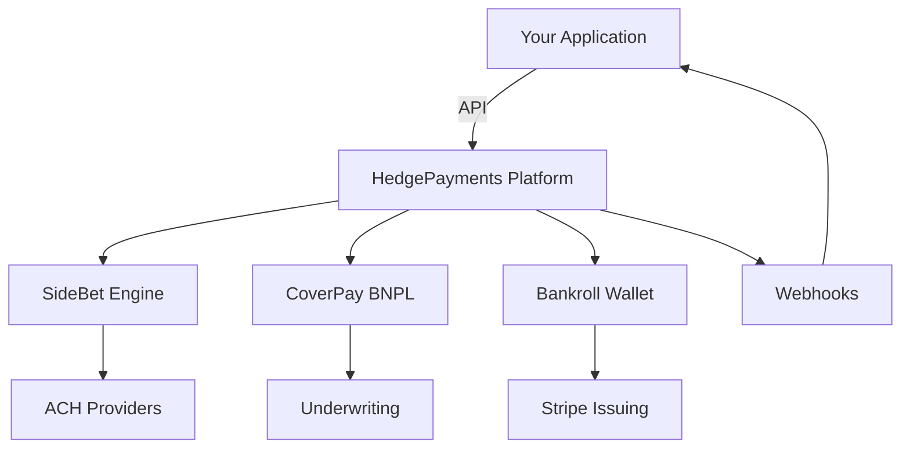

## The Future of Payments

HedgePayments is the infrastructure layer powering the next generation of payment solutions. We've built three distinct products that solve real problems in the payment space.

<CardGroup cols={3}>
  <Card
    title="SideBet"
    icon="coins"
    href="/products/sidebet"
  >
    **Round-ups as a Service**

    Transform spare change into meaningful contributions with automated round-up technology.
  </Card>
  <Card
    title="CoverPay"
    icon="shield-check"
    href="/products/coverpay"
  >
    **The Best BNPL**

    Buy now, pay later reimagined. Flexible payments without the predatory practices.
  </Card>
  <Card
    title="Bankroll"
    icon="wallet"
    href="/products/bankroll"
  >
    **As a Payment Method**

    A complete digital wallet that works everywhere as a native payment option.
  </Card>
</CardGroup>

---

## Our Products

### SideBet — Round-ups as a Service

<Info>
  **Perfect for**: Fintech apps, investment platforms, savings apps, charitable giving platforms
</Info>

SideBet is a white-label round-up platform that enables businesses to integrate spare change functionality into their applications. Every transaction becomes an opportunity for users to save, invest, or donate.

**Key Features:**
- Automatic round-up calculation on every transaction
- Configurable multipliers (1x, 2x, 3x, 5x)
- Batch ACH transfers at customizable thresholds
- White-label React components
- Real-time webhooks

<CodeGroup>

```javascript JavaScript
import { SideBet } from '@hedgepayments/sidebet';

const sidebet = new SideBet({ apiKey: 'your-key' });

// Enable round-ups for a user
await sidebet.roundups.enable(userId, {
  multiplier: 2,
  threshold: 5.00,  // Transfer when $5 accumulated
  destination: 'savings'
});
```

```python Python
from hedgepayments import SideBet

sidebet = SideBet(api_key='your-key')

# Enable round-ups for a user
sidebet.roundups.enable(
    user_id=user_id,
    multiplier=2,
    threshold=5.00,
    destination='savings'
)
```

</CodeGroup>

---

### CoverPay — The Best BNPL

<Info>
  **Perfect for**: E-commerce, marketplaces, P2P payment apps, subscription services
</Info>

CoverPay is buy now, pay later done right. No hidden fees, no predatory interest rates, no credit score damage. Just flexible payments that work for everyone.

**What Makes CoverPay Different:**
- **Transparent pricing** — No hidden fees, ever
- **Soft credit checks** — Pre-qualification without impacting credit score
- **Flexible repayment** — Pay in 4, monthly plans, or custom schedules
- **Instant decisions** — Real-time approval in milliseconds
- **Responsible lending** — Built-in affordability checks

<CodeGroup>

```javascript JavaScript
import { CoverPay } from '@hedgepayments/coverpay';

const coverpay = new CoverPay({ apiKey: 'your-key' });

// Check if user qualifies
const qualification = await coverpay.prequalify({
  userId: 'user-123',
  amount: 150.00
});

if (qualification.approved) {
  // Create a CoverPay payment
  const payment = await coverpay.createPayment({
    userId: 'user-123',
    amount: 150.00,
    plan: 'pay-in-4',  // or 'monthly', 'custom'
    merchantId: 'merchant-456'
  });
}
```

```python Python
from hedgepayments import CoverPay

coverpay = CoverPay(api_key='your-key')

# Check if user qualifies
qualification = coverpay.prequalify(
    user_id='user-123',
    amount=150.00
)

if qualification.approved:
    # Create a CoverPay payment
    payment = coverpay.create_payment(
        user_id='user-123',
        amount=150.00,
        plan='pay-in-4',
        merchant_id='merchant-456'
    )
```

</CodeGroup>

---

### Bankroll — As a Payment Method

<Info>
  **Perfect for**: Apps wanting to offer Bankroll as a checkout option alongside cards and wallets
</Info>

Bankroll isn't just a wallet—it's a payment method. Integrate Bankroll as a first-class payment option in your checkout flow, giving users a seamless way to pay with their Bankroll balance.

**Why Offer Bankroll:**
- **Instant settlement** — No waiting for card networks
- **Lower fees** — Significantly cheaper than card processing
- **Built-in users** — Tap into the Bankroll user base
- **Virtual cards** — Powered by Stripe Issuing
- **P2P ready** — Send and receive between users

<CodeGroup>

```javascript JavaScript
import { Bankroll } from '@hedgepayments/bankroll';

const bankroll = new Bankroll({
  apiKey: 'your-key',
  merchantId: 'your-merchant-id'
});

// Check if user has Bankroll and sufficient balance
const eligibility = await bankroll.checkPaymentEligibility({
  userId: 'user-123',
  amount: 25.00
});

if (eligibility.canPay) {
  // Process payment with Bankroll
  const payment = await bankroll.processPayment({
    userId: 'user-123',
    amount: 25.00,
    description: 'Order #12345'
  });
}
```

```python Python
from hedgepayments import Bankroll

bankroll = Bankroll(
    api_key='your-key',
    merchant_id='your-merchant-id'
)

# Check eligibility
eligibility = bankroll.check_payment_eligibility(
    user_id='user-123',
    amount=25.00
)

if eligibility.can_pay:
    # Process payment
    payment = bankroll.process_payment(
        user_id='user-123',
        amount=25.00,
        description='Order #12345'
    )
```

</CodeGroup>

---

## Getting Started

<Steps>
  <Step title="Choose Your Product">
    Decide which HedgePayments product fits your use case—or use multiple together
  </Step>
  <Step title="Get API Keys">
    Sign up at [dashboard.hedgepayments.com](https://dashboard.hedgepayments.com) and get your credentials
  </Step>
  <Step title="Integrate">
    Follow our quickstart guides to integrate in minutes
  </Step>
  <Step title="Go Live">
    Test in sandbox, then switch to production when ready
  </Step>
</Steps>

## Platform Architecture



## Why HedgePayments?

<AccordionGroup>
  <Accordion title="One Integration, Three Products" icon="plug">
    Integrate once with HedgePayments and unlock access to SideBet, CoverPay, and Bankroll. Mix and match based on your needs.
  </Accordion>
  <Accordion title="Built for Developers" icon="code">
    Clean APIs, comprehensive SDKs, detailed documentation, and a sandbox environment for testing. We speak your language.
  </Accordion>
  <Accordion title="Enterprise Security" icon="shield">
    PCI DSS Level 1 compliant, SOC 2 Type II certified, end-to-end encryption, and bank-grade security infrastructure.
  </Accordion>
  <Accordion title="Real-Time Everything" icon="bolt">
    WebSocket support for instant notifications. Know immediately when payments succeed, fail, or need attention.
  </Accordion>
</AccordionGroup>

## Quick Links

<CardGroup cols={2}>
  <Card
    title="SideBet Quickstart"
    icon="bolt"
    href="/products/sidebet/quickstart"
  >
    Start with round-ups in 5 minutes
  </Card>
  <Card
    title="CoverPay Integration"
    icon="credit-card"
    href="/products/coverpay/quickstart"
  >
    Add BNPL to your checkout
  </Card>
  <Card
    title="Bankroll Setup"
    icon="wallet"
    href="/products/bankroll/quickstart"
  >
    Accept Bankroll payments
  </Card>
  <Card
    title="API Reference"
    icon="code"
    href="/api-reference"
  >
    Explore all endpoints
  </Card>
</CardGroup>

## Support

<CardGroup cols={2}>
  <Card
    title="Discord Community"
    icon="discord"
    href="https://discord.gg/hedgepayments"
  >
    Join our developer community
  </Card>
  <Card
    title="Email Support"
    icon="envelope"
    href="mailto:support@hedgepayments.com"
  >
    Get help from our team
  </Card>
</CardGroup>
