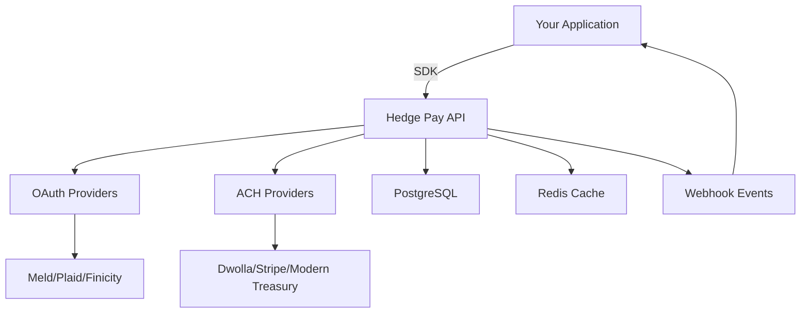

## What is Hedge Pay Round-ups?

Hedge Pay Round-ups is a white-label platform that enables businesses to integrate spare change round-up functionality into their applications. We handle the complex financial infrastructure so you can focus on your core product.

<CardGroup cols={2}>
  <Card
    title="Quick Integration"
    icon="bolt"
    href="/quickstart"
  >
    Get up and running in minutes with our SDKs
  </Card>
  <Card
    title="API Reference"
    icon="code"
    href="/api-reference/introduction"
  >
    Explore our comprehensive REST API
  </Card>
  <Card
    title="Interactive Playground"
    icon="play"
    href="/api-reference/introduction"
  >
    Test API endpoints directly in your browser
  </Card>
  <Card
    title="Security First"
    icon="shield"
    href="/guides/security/best-practices"
  >
    Bank-grade security and compliance
  </Card>
</CardGroup>

## Key Features

<AccordionGroup>
  <Accordion title="Multiple Payment Providers" icon="credit-card">
    Seamlessly switch between OAuth providers (Meld, Plaid, Finicity) and ACH providers (Dwolla, Stripe, Modern Treasury) without changing your code.
  </Accordion>
  <Accordion title="White-Label Ready" icon="palette">
    Fully customizable UI components that match your brand. Use our pre-built React components or build your own with our SDK.
  </Accordion>
  <Accordion title="Real-Time Updates" icon="bolt">
    WebSocket support for instant notifications on transfers, round-ups, and account changes.
  </Accordion>
  <Accordion title="Enterprise Security" icon="lock">
    PCI compliant infrastructure with end-to-end encryption, audit logging, and comprehensive security measures.
  </Accordion>
</AccordionGroup>

## How It Works

<Steps>
  <Step title="Connect Bank Account">
    Users securely link their bank accounts through our OAuth providers
  </Step>
  <Step title="Monitor Transactions">
    We track transactions and calculate round-up amounts based on user preferences
  </Step>
  <Step title="Process Round-ups">
    Spare change is automatically transferred via ACH to the designated account
  </Step>
  <Step title="Track & Report">
    Real-time webhooks and comprehensive reporting for all activities
  </Step>
</Steps>

## Platform Architecture



## Available SDKs

<CodeGroup>

```javascript JavaScript
npm install @hedge/sdk-core
```

```react React
npm install @hedge/sdk-react
```

```python Python
pip install hedge-roundups
```

```ruby Ruby
gem install hedge-roundups
```

</CodeGroup>

## Quick Example

<CodeGroup>

```javascript JavaScript
import { HedgeSDK } from '@hedge/sdk-core';

const sdk = new HedgeSDK({
  apiKey: 'your-api-key',
  partnerId: 'your-partner-id'
});

// Create a user
const user = await sdk.users.create({
  email: 'user@example.com',
  firstName: 'John',
  lastName: 'Doe'
});

// Enable round-ups
await sdk.roundups.enable(user.id);
```

```react React
import { HedgeProvider, RoundupSettings } from '@hedge/sdk-react';

function App() {
  return (
    <HedgeProvider apiKey="your-api-key">
      <RoundupSettings 
        userId={userId}
        theme="custom"
      />
    </HedgeProvider>
  );
}
```

```python Python
from hedge_roundups import HedgeClient

client = HedgeClient(
    api_key='your-api-key',
    partner_id='your-partner-id'
)

# Create a user
user = client.users.create(
    email='user@example.com',
    first_name='John',
    last_name='Doe'
)

# Enable round-ups
client.roundups.enable(user.id)
```

</CodeGroup>

## Support

<CardGroup cols={2}>
  <Card
    title="Discord Community"
    icon="discord"
    href="https://discord.gg/hedgepay"
  >
    Join our developer community for support
  </Card>
  <Card
    title="Email Support"
    icon="envelope"
    href="mailto:support@hedgepay.com"
  >
    Get help from our support team
  </Card>
</CardGroup>

## Ready to Get Started?

<Card
  title="Start Building"
  icon="rocket"
  href="/quickstart"
>
  Follow our quickstart guide to integrate round-ups in minutes
</Card>